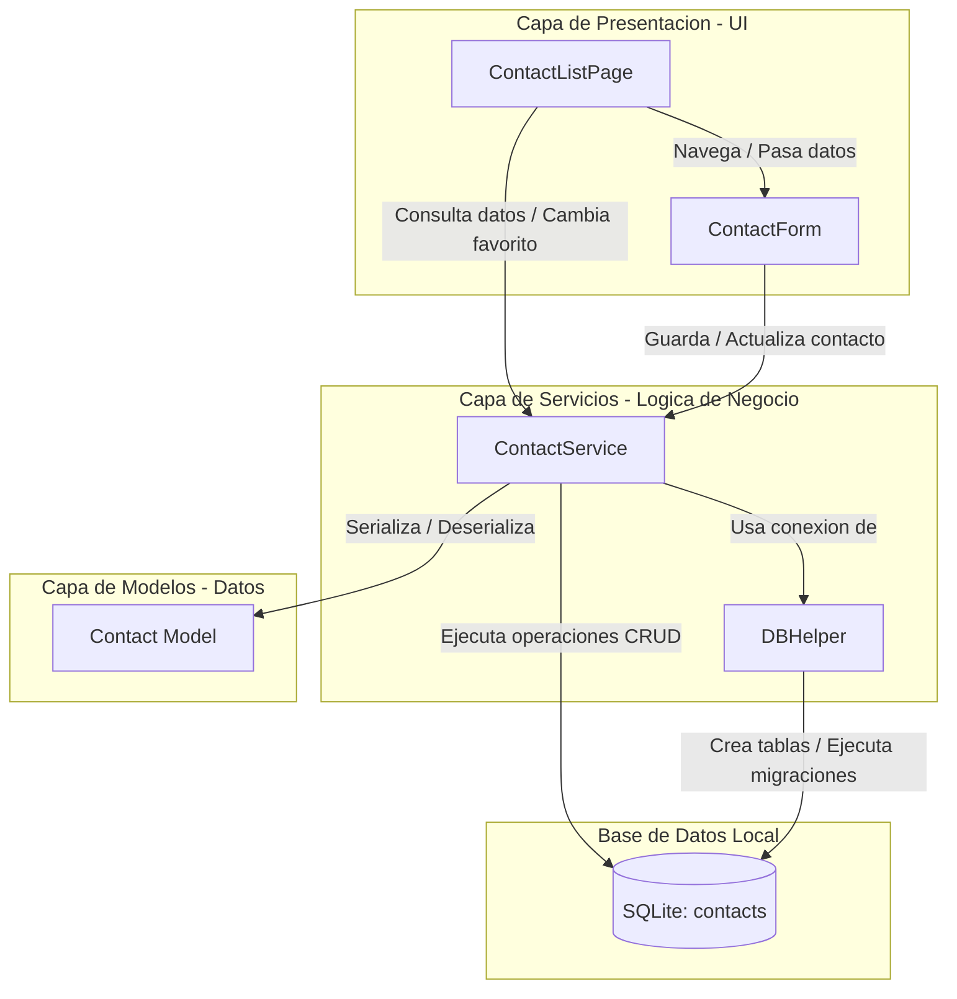

# CRUD de Contactos con SQLite en Flutter

Este proyecto es una aplicacion movil desarrollada en Flutter que implementa un sistema CRUD (Crear, Leer, Actualizar y Eliminar) para la gestion de una agenda de contactos local utilizando SQLite como motor de base de datos.

## Arquitectura de la Aplicacion

La aplicacion esta diseñada siguiendo una arquitectura limpia estructurada en capas, lo que permite separar la logica de negocio de la interfaz de usuario y facilitar el mantenimiento del codigo.



### Capa de Modelos (Models)
* **contact.dart**: Define la clase de datos `Contact`. Se encarga de la representacion del modelo de dominio y contiene los metodos de serializacion (`toMap`) y deserializacion (`fromMap`) necesarios para interactuar con la base de datos SQLite.

### Capa de Servicios (Services)
* **db_helper.dart**: Gestor de la conexion con SQLite. Se encarga de la inicializacion de la base de datos, configuracion de la factoria de base de datos segun la plataforma (movil, web o ffi) y manejo de esquemas de tablas. Incluye control de versiones y migracion para actualizar esquemas previos sin perder integridad.
* **contact_service.dart**: Contiene la logica de acceso a datos (DAO). Implementa metodos asincronos para realizar las operaciones CRUD (insertar, consultar, actualizar, borrar) y la logica especifica de negocio como el cambio rapido de estado favorito.

### Capa de Presentacion (Pages)
* **contact_list.dart**: Interfaz principal que muestra la agenda. Implementa filtrado dinamico mediante una barra de busqueda por texto, pestañas de segmentacion (Todos / Favoritos) y actualizacion automatica de estados de forma reactiva.
* **contact_form.dart**: Formulario especializado en la creacion y edicion de contactos, equipado con validaciones de campos obligatorios, formatos de correo electronico y seleccion de favoritos.

---

## Estructura del Proyecto

El codigo fuente esta organizado dentro del directorio `lib` de la siguiente manera:

```text
lib/
├── main.dart                  # Punto de entrada de la aplicacion y configuracion del tema
├── models/
│   └── contact.dart           # Estructura de datos del contacto
├── services/
│   ├── db_helper.dart         # Inicializacion y control de versiones de SQLite
│   └── contact_service.dart   # Consultas y transacciones de base de datos
└── pages/
    ├── contact_list.dart      # Pantalla principal y controles de busqueda/filtrado
    └── contact_form.dart      # Pantalla de creacion y edicion de contactos
```

---

## Funcionamiento de la Aplicacion

### Persistencia Local con SQLite
La aplicacion utiliza la base de datos local `user_database.db`. Al iniciarse por primera vez, el `DBHelper` crea la tabla `contacts` con la siguiente estructura:
* `id` (Entero, Clave Primaria Autoincremental)
* `name` (Texto, No Nulo)
* `phone` (Texto, No Nulo)
* `email` (Texto, No Nulo)
* `is_favorite` (Entero, No Nulo, por defecto 0)

Si se detecta una version anterior de la base de datos (por ejemplo, con la antigua tabla `users`), se ejecuta un proceso de migracion automatica mediante `onUpgrade` para adaptar el esquema a la nueva tabla `contacts`.

### Operaciones del CRUD
1. **Creacion (Create)**: A traves del formulario se recopilan los datos del contacto. Al presionar guardar, se valida el formulario y se envia a `ContactService.createContact()`, que retorna el registro creado con su ID autogenerado.
2. **Lectura (Read)**:
   * Al cargar la pantalla principal, se recuperan todos los registros ordenados prioritariamente por favoritos y luego alfabeticamente.
   * La busqueda filtra localmente los resultados basandose en el nombre, telefono o correo.
   * Las pestañas permiten alternar instantaneamente entre la vista de todos los contactos o unicamente los marcados como favoritos.
3. **Actualizacion (Update)**:
   * El formulario se reutiliza en modo edicion precargando los datos del contacto seleccionado.
   * En la pantalla principal, se puede alternar el estado de favorito (si/no) directamente tocando el icono de la estrella sin necesidad de abrir el formulario de edicion completo.
4. **Eliminacion (Delete)**: Se presenta un cuadro de dialogo para confirmar la eliminacion del registro. Tras la confirmacion, se invoca a `ContactService.deleteContact()` y se actualiza la lista en pantalla.

---

## Requisitos de Ejecucion

Para compilar y ejecutar este proyecto de manera local, asegurese de tener instalado:
* Flutter SDK (Version 3.22.0 o superior recomendada)
* Herramientas de compilacion para la plataforma destino (Android Studio, Xcode, o Visual Studio C++ build tools)

### Pasos para iniciar:
1. Clonar el repositorio.
2. Obtener las dependencias ejecutando:
   ```bash
   flutter pub get
   ```
3. Ejecutar la aplicacion en el dispositivo o emulador seleccionado:
   ```bash
   flutter run
   ```
## Caputras de Pantalla


